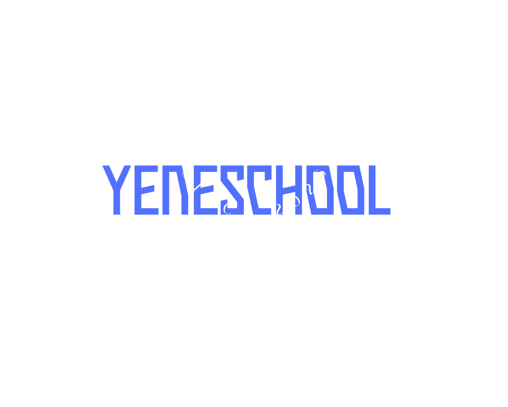

<div align="center">



# YeneSchool OS

### The World's First Autonomous AI-Director School Operating System
**Built for Ethiopian K–12 and Higher Educational Institutions**

[](https://nextjs.org/)
[](https://react.dev/)
[](https://www.typescriptlang.org/)
[](https://tailwindcss.com/)
[](LICENSE)

[](https://www.yeneschooldocumentation.vercel.app)
[](https://t.me/yeneschool_bot)

---

</div>

## Overview

**YeneSchool OS** is Ethiopia's premier institutional School Operating System engineered by **HUMAN Tech PLC** in Addis Ababa. Designed from the ground up for the operational, academic, and financial reality of Ethiopian schools, YeneSchool puts school operations on true autopilot.

While the campus sleeps, the **Autonomous AI Director** audits attendance, flags syllabus pacing delays, drafts 5E pedagogical lesson plans, evaluates student risk factors, and reconciles CBE Birr and Telebirr tuition payments. By 07:00 AM, leadership receives an executive briefing with pre-resolved operational actions—zero manual spreadsheets required.

---

## Key Pillars & Core Capabilities

### 1. Autonomous AI Director & Morning Briefings
- **Pre-Dawn Audits:** Scans yesterday's attendance, syllabus milestones, and cashier receipts automatically.
- **Executive Cockpit:** Daily 07:00 AM synthesized briefing with actionable remediation proposals for school principals and directors.
- **Natural Language Assistant:** Interactive institutional AI assistant trained on platform workflows and MOE directives.

### 2. Dual Ethiopian & Gregorian Calendar Engine
- **Native 13-Month Support:** Built-in Meskerem–Pagume calendar navigation alongside Gregorian timestamps.
- **Ethiopian MOE Report Cards:** Automated generation of official Ethiopian Ministry of Education term reports and transcripts.

### 3. Adaptive Student Remediation & Exam Bank
- **Grade 12 National Exam Prep:** Comprehensive question bank mapped to the Ethiopian national curriculum.
- **Early Risk Detection:** Identifies struggling students across continuous assessment periods and generates targeted booster packages.

### 4. Telebirr & CBE Cashless Finance
- **Automated Payment Reconciliation:** Instant cryptographic verification of Ethio Telecom Telebirr and Commercial Bank of Ethiopia (CBE Birr) tuition transactions.
- **Zero Reconciliation Leakage:** Direct matching of bank reference tokens against student ledgers with automated parent SMS/Telegram receipts.

### 5. Offline-First Edge Resilience
- **Local Gateway Sync:** Campuses continue attendance scanning and grade recording even during internet disruptions.
- **Conflict-Free Synchronization:** Automatic bi-directional cloud synchronization as soon as connectivity resumes.

---

## Platform Architecture

```
├── src/
│   ├── app/                      # Next.js 16 App Router
│   │   ├── api/                  # Edge & Serverless API Routes
│   │   ├── blog/                 # Educational Case Studies & Implementation Insights
│   │   ├── contact/              # Institutional Demo Booking & Leadership Inquiry
│   │   ├── gallery/              # Live System UI Tour & Dashboard Walkthrough
│   │   ├── privacy/              # Student & Institutional Data Privacy Policy
│   │   ├── projects/             # 24 Integrated Core Modules Catalog
│   │   ├── terms/                # Institutional Master Subscription Terms
│   │   └── page.tsx              # Main Platform Landing & Cockpit Showcase
│   ├── components/
│   │   ├── layout/               # Header, MegaNav, Footer, AI Chatbot
│   │   ├── sections/             # HeroVisual, Pricing, IdentitySequence, Stats
│   │   └── ui/                   # High-performance 3D & interactive visual primitives
│   ├── data/                     # Unified modules database & platform schema
│   └── styles/                   # Tailwind configuration & global CSS
├── public/                       # High-resolution platform dashboards & vector logos
```

---

## 24 Unified Core Modules

YeneSchool integrates 24 purpose-built modules into a single, cohesive institutional platform:

1. **Academic Management** — Grade 1–12 structure, period timetables, and academic calendar.
2. **Student Promotion & Risk AI** — Predictive remediation and automated grade progression.
3. **5E Lesson Plan Generator** — AI-assisted lesson preparation for teachers.
4. **Attendance & Clock-In** — Offline gate checks, period tracking, and parent absence alerts.
5. **Cashless Tuition Engine** — Telebirr and CBE Birr instant payment reconciliation.
6. **National Exam Bank** — Grade 8 and Grade 12 practice sets with step-by-step solutions.
7. **Parent Telegram Portal** — Real-time grade notifications and tuition receipt delivery.
8. **Multi-Campus Network** — Centralized cross-branch administration and regional telemetry.
*(and 16 additional modules covering HR, inventory, library, transport, and grading).*

---

## Getting Started

### Prerequisites
- Node.js 18.18+ or 20+
- npm / yarn / pnpm

### Installation

```bash
# Clone the repository
git clone https://github.com/usman1121/sms.git
cd sms

# Install dependencies
npm install

# Run development server
npm run dev
```

Open [http://localhost:3000](http://localhost:3000) in your browser to explore the platform.

---

## Institutional Compliance & Data Security

- **Student Data Privacy:** We never sell, advertise, or commercialize student data. All academic archives remain the sovereign property of the school.
- **Bank-Grade Encryption:** AES-256 encryption at rest and TLS 1.3 in transit across all server nodes.
- **MOE Alignment:** Standardized reporting compliance with Ethiopian Ministry of Education regulations.

For complete details, review our [Privacy Policy](src/app/privacy/page.tsx) and [Terms of Service](src/app/terms/page.tsx).

---

## Contact & Head Office

- **Provider:** HUMAN Tech PLC
- **Location:** Bole Subcity, Addis Ababa, Ethiopia
- **Email:** [contact@yeneschool.com](mailto:contact@yeneschool.com)
- **Telegram Bot:** [@yeneschool_bot](https://t.me/yeneschool_bot)
- **Documentation:** [yeneschooldocumentation.vercel.app](https://www.yeneschooldocumentation.vercel.app)

---

<div align="center">

© 2026 YeneSchool OS • HUMAN Tech PLC. All rights reserved.

</div>
